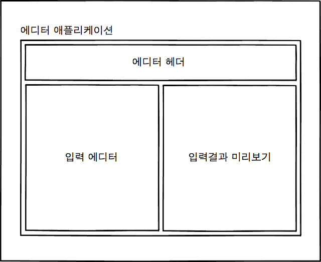
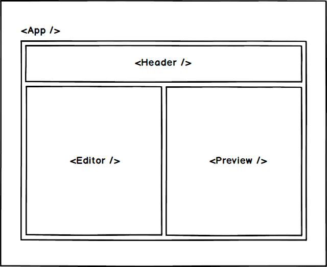
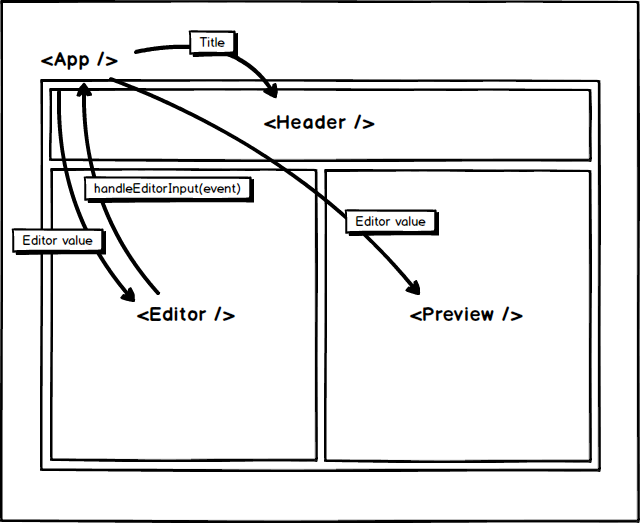

# 리액트로 만드는 초간단 마크다운 에디터!

## 앱의 구성

React에서 UI구조과 데이터 flow의 기본 단위는 컴포넌트입니다. 하나의 페이지를 구성하는데에는 의미적으로 구분할 수 있습니다.

가령, 쇼핑몰 사이트의 경우에는 상단 메뉴, 좌측 카테고리 리스트, 중앙 상품 리스트, 상품 박스 등으로 구성되어있습니다. 이 하나하나의 의미적인 요소를 독립적인 컴포넌트로 만들 수 있습니다.

이런 요소들을 컴포넌트화하게되면, 하나의 컴포넌트 조각을 여러 위치에 다시 사용할 수 있다는 장점이 있습니다. 이렇게 요소들을 재사용한다면 생산성이 상승하겠죠?

오늘 실습할 마크다운 에디터는 아래와 같이 구성될 것입니다.


- 애플리케이션
  - 에디터 헤더: 에디터의 title을 표현할 UI.
  - 입력 에디터: 사용자가 markdown syntax를 입력할 필드.
  - 입력결과 미리보기: 입력한 markdown을 html으로 parse하여 DOM에 출력. 

이제 위에서 살펴본 의미적인 구성 요소 각각을 컴포넌트화하면 아래와 같은 구성을 이룰 수 있습니다.


## 앱 데이터 흐름

리액트에서는 데이터를 관리하는 두가지 개념이 있습니다. 바로 `props`와 `state`입니다.

`props`는 부모 컴포넌트가 자식 컴포넌트에게 데이터를 전해줄 때 사용합니다. 여기서 유의할점은 `props`로 전달되는 데이터는 단방향이라는 것입니다. 부모가 자식에게 데이터를 전해줄 수는 있지만, 자식이 부모에게 데이터를 전할수는 없습니다.

`state`는 컴포넌트가 고유하게 가지고있는 상태 데이터입니다. 이 데이터는 주로 컴포넌트의 UI의 상태를 관리하는데 사용하죠. 예를들어, 현재 input에 입력된 값을 관리하거나, 현재 활성화된 탭이 무엇인지 등을 `state`를 통해 관리할 수 있죠.

우리 앱은 아래와 같은 흐름으로 데이터를 관리할 것입니다.


`<App>`
- 앱 전부를 관장하는 컴포넌트로써 모든 데이터 흐름의 중앙에 있습니다.
- 모든 데이터를 컴포넌트 state로 관리, 기록합니다.

`<Header>`
- 앱 상단의 헤더를 표현하는 UI컴포넌트.
- 부모인 `App`에게서 title이라는 props를 전달받아 렌더링합니다.

`<Editor>`
- markdown syntax를 입력하는 필드.
- 해당 필드에 입력한 내용은 부모인 `App`이 props으로 제공하는 `handleEditorInput()`핸들러의 parameter에 데이터를 실어 부모에게 전달.
- 전달받은 데이터를 state에 기록한 `App`은 해당 데이터(value)를 `Editor`에 다시 전달하면 `Editor`는 입력 필드에 해당 데이터를 렌더링합니다.

`<Preview>`
- html로 변환된 markdown이 렌더링되는 컴포넌트.
- `Editor`에서 입력한 값을 부모인 `App`으로 전달받아 markup으로 parse하여 렌더링합니다.

## 컴포넌트 구성

### \<App />

```
import React, { Component } from "react";
import Header from "../Header";
import Editor from "../Editor";
import Preview from "../Preview";
import "./index.css";

// 마크다운 에디터를 품고있는 main 컴포넌트
class App extends Component {
    // 리액트 컴포넌트의 state
    state = {
        editor: "" // 관리되는 데이터인 editor.
    }
    
    // 리액트 lifecycle method.
    // 컴포넌트가 mount되기 전 호출됩니다.
    componentWillMount() {
        // 브라우저 로컬스토리지의 content를 조회하여
        if (window.localStorage.content) {
            this.setState({
                editor: window.localStorage.content  // 해당 데이터를 컴포넌트의 editor에 저장합니다.
            })
        }
    }

    // Editor 컴포넌트에 제공되는 method.
    handleEditorInput(e) {
        this.setState({ editor: e.target.value }); // synthetic event에 담긴 사용자 입력값에 접근하여 해당 데이터를 App 컴포넌트의 state에 저장합니다.
        window.localStorage.setItem("content", e.target.value); // 또한 해당 데이터를 브라우저 localStorage에도 저장합니다. 브라우저 탭을 닫았다가 다시 켜도 내용이 사라지지 않기 위함입니다.
    }

    render() {
        return (
            <div className="app">
                <Header
                    title={"혁우의 에디터!"}
                />
                <div className="editor-group">
                    <Editor
                        onInputChange={(e) => this.handleEditorInput(e)} // 메소드 제공
                        editorValue={this.state.editor} // value 제공
                    />
                    <Preview
                        inputValue={this.state.editor} // value 제공
                    />
                </div>
            </div>
        );
    }
}

export default App;
```
### \<Header />
```
import React from "react";
import "./index.css";

const Header = ({ title }) => {
    return (
        <div className="header">
            <div className="title">{ title }</div>
        </div>
    );
};

export default Header;
```
### \<Editor />
```
import React from "react";
import "./index.css";

const Editor = ({ onInputChange, value }) => {
    return (
        <div className="editor">
            <textarea
                autoFocus={false}
                onChange={(e) => onInputChange(e)}
                value={value}
            />
        </div>
    );
}

export default Editor;
```
### \<Preview />
```
import React from "react";
import showdown from "showdown";
import "./index.css";

const Preview = ({ inputValue }) => {
    const converter = new showdown.Converter();
    const html = converter.makeHtml(inputValue);

    return (
        <div className="preview" dangerouslySetInnerHTML={{ __html: html }} />
    );
}

export default Preview;
```